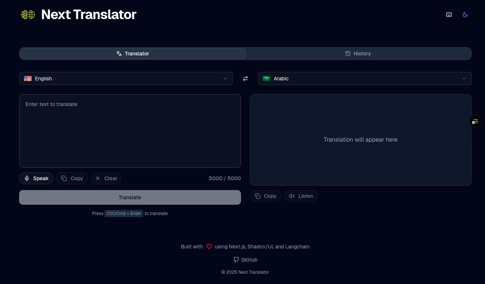

# Next Translator


A modern Next.js application for translating text between multiple languages using the power of Google's Gemini AI model. Built with Next.js 15, Shadcn/UI, and LangChain for seamless AI integration.

<div align="center">
  
</div>

## 🌟 Key Features

- **Powerful Translation**: Translate text between 20+ languages with high accuracy using Google's Gemini AI
- **Modern UI**: Clean, responsive interface built with Shadcn/UI components and Tailwind CSS
- **Language Detection**: Automatic language detection for input text
- **Translation History**: Save and manage your translation history
- **Text-to-Speech**: Listen to translated text with built-in speech synthesis
- **Dark/Light Mode**: Toggle between dark and light themes
- **Keyboard Shortcuts**: Enhance productivity with keyboard controls
- **Mobile-Friendly**: Fully responsive design works on all devices

## 🛠️ Technology Stack

- **Frontend**: Next.js 15, TypeScript
- **Styling**: Tailwind CSS 4, Shadcn/UI, Framer Motion
- **AI Integration**: LangChain, Google Gemini AI
- **State Management**: React Hooks
- **Build Tools**: Turbopack, ESLint, Prettier

## 📋 Prerequisites

Before you begin, ensure you have the following installed:

- **Node.js**: v18.x or higher
- **PNPM**: v8.x or higher (package manager)
- **Google API Key**: Access to Google's Generative AI (Gemini) API

## 📥 Installation

1. Clone the repository:

   ```bash
   git clone https://github.com/abdalrohman/next_translator.git
   cd next_translator
   ```

2. Install dependencies using PNPM:
   ```bash
   pnpm install
   ```

## ⚙️ Configuration

1. Create a `.env` file in the root directory by copying the example:

   ```bash
   cp .env.example .env
   ```

2. Add your Google API key(s) to the `.env` file:

   ```
   # Google API Keys for Gemini AI
   # You can add multiple keys for load balancing
   GOOGLE_API_KEY="your_google_api_key_here"
   GOOGLE_API_KEY_1="optional_additional_key_1"
   GOOGLE_API_KEY_2="optional_additional_key_2"

   # Optional: Groq API Keys (if using Groq models)
   # Note: Groq integration is planned but not yet implemented
   GROQ_API_KEY="your_groq_api_key_here"

   # Application URL (for production CORS settings)
   NEXT_PUBLIC_APP_URL="http://localhost:3000"
   ```

3. **API Key Configuration Notes**:
   - You can provide a single API key using just `GOOGLE_API_KEY`
   - For high-volume usage, add multiple keys (`GOOGLE_API_KEY_1`, `GOOGLE_API_KEY_2`, etc.)
   - When multiple keys are configured, the application will randomly select one for each request to distribute usage and avoid rate limits

## 🚀 Running the Project

1. Start the development server with Turbopack:

   ```bash
   pnpm dev
   ```

2. Open your browser and navigate to:

   ```
   http://localhost:3000
   ```

3. To build for production:

   ```bash
   pnpm build
   ```

4. To start the production server:
   ```bash
   pnpm start
   ```

## 🔍 Usage

1. **Translate Text**:

   - Select source and target languages from the dropdown menus
   - Enter text in the input field
   - Click "Translate" or press Ctrl+Enter to translate
   - For longer texts, the application handles up to 5000 characters per translation

2. **View Translation History**:

   - Click on the "History" tab to view past translations
   - Click on any history item to load it back into the translator
   - Translation history is stored in your browser's localStorage
   - Up to 50 most recent translations are saved automatically
   - History persists between sessions but is limited to the current browser

3. **Listen to Translation**:

   - Click the speaker icon on the output panel to hear the translated text
   - Uses the browser's built-in SpeechSynthesis API
   - Voice and accent are determined by the target language
   - Click the speaker icon again to stop the current speech
   - Note: Speech synthesis quality varies by browser and language

4. **Switch Themes**:
   - Toggle between light and dark modes using the theme switcher in the header
   - Your theme preference is saved between sessions
   - Automatically respects your system's theme preference by default

## 📸 Screenshots

<details>
<summary>Click to view more screenshots</summary>

### Main Interface


The main interface showcases the clean, modern design with.

</details>

## 🤝 Contributing

Contributions are welcome! Please follow these guidelines:

1. Fork the repository
2. Create your feature branch:
   ```bash
   git checkout -b feature/amazing-feature
   ```
3. Ensure code quality:
   - Run `pnpm fix` before committing to ensure code is clean and formatted
   - This runs both ESLint and Prettier
4. Follow the Conventional Commits specification for commit messages:
   ```bash
   git commit -m 'feat: add amazing feature'
   git commit -m 'fix: resolve issue with translation'
   git commit -m 'docs: update documentation'
   git commit -m 'style: format code'
   git commit -m 'refactor: improve code structure'
   git commit -m 'perf: optimize performance'
   git commit -m 'test: add unit tests'
   ```
5. Push to the branch:
   ```bash
   git push origin feature/amazing-feature
   ```
6. Open a Pull Request

## 🌐 API Usage

You can use the translation API directly with curl:

```bash
# Translate text
curl -X POST http://localhost:3000/api/translate \
  -H "Content-Type: application/json" \
  -d '{"text": "Hello world", "sourceLanguage": "en", "targetLanguage": "es"}'

# Detect language
curl -X POST http://localhost:3000/api/detect \
  -H "Content-Type: application/json" \
  -d '{"text": "Hello world"}'
```

## 📝 TODO List

Future enhancements planned for the project:

- [ ] Implement Groq API integration (currently only configured but not implemented)
- [ ] Support structured output from LLMs for better translation results:
  - [ ] Example usage in context
  - [ ] Multiple word options for translations
  - [ ] Definitions and synonyms
- [ ] Enhance text-to-speech capabilities using Groq API and Eleven Labs
- [ ] Improve translation prompts for better accuracy
- [ ] Expand supported languages to include more options
- ... and more!

## ⚙️ Technical Notes

### API Keys and Integration

- **Multiple API Keys**: When multiple Google API keys are configured, the application will randomly switch between them to distribute usage and avoid rate limits.
- **Groq Integration**: Groq API configuration is included but not yet implemented. It's on the roadmap for future development.

### Application Architecture

- **Next.js App Router**: The application uses Next.js 15's App Router for routing and server components.
- **API Routes**: Translation and language detection are handled through Next.js API routes that securely call the Gemini API.
- **Server-Side Security**: API keys are only used server-side to prevent exposure in client-side code.
- **Client Components**: Interactive UI elements use the "use client" directive while maintaining server components where possible.

### Data Storage

- **Local Storage**: User preferences and translation history are stored in the browser's localStorage.
- **No Server Database**: This application doesn't require a database as all user data is stored locally.
- **Persistence**: Language preferences, theme settings, and translation history persist between sessions.

### Web Manifest

- The application includes both `manifest.json` and `site.webmanifest` for maximum compatibility across browsers.
- These files enable "Add to Home Screen" functionality on mobile devices.
- Icons in various sizes are provided in the `/public/favicons/` directory.

## 📄 License

This project is licensed under the MIT License - see the `LICENSE` file for details.

## 👤 Author

- **M.Abdulrahman Alnaseer** - [abdalrohman](https://github.com/abdalrohman)
